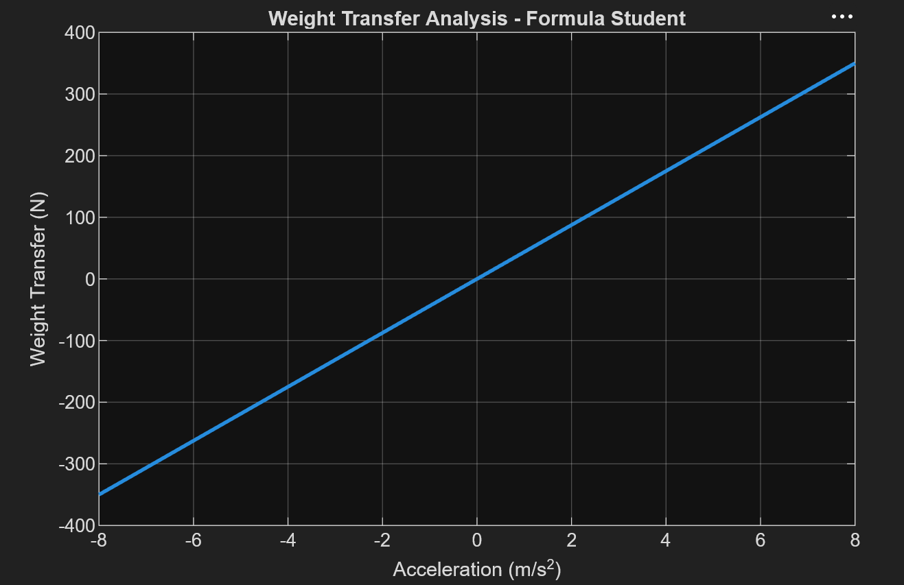
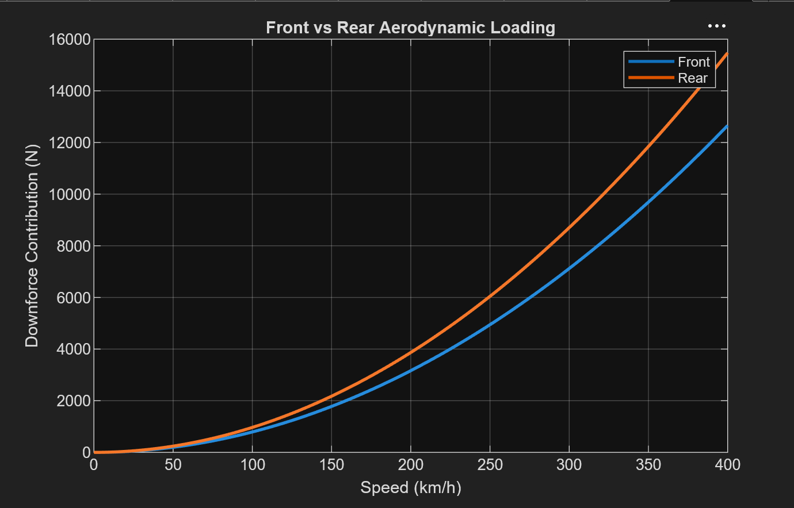
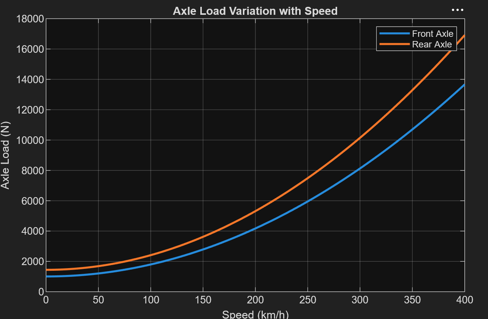

# Vehicle Dynamics, Traction, and Aerodynamic Performance Simulator

A MATLAB-based vehicle dynamics simulator developed to analyze weight transfer, traction characteristics, aerodynamic loading, and vehicle performance limits using first-principles engineering models.

The simulator supports multiple vehicle configurations, including Formula 1, Formula Student, Hatchbacks, SUVs, and custom user-defined vehicles.

---

## Features

- Longitudinal weight transfer analysis under acceleration and braking
- Aerodynamic drag and downforce modeling
- Front and rear axle load distribution analysis
- Power-limited top speed estimation
- Vehicle comparison across different architectures
- Parametric studies on:
  - CG Height
  - Wheelbase
  - Aerodynamic coefficients

---

## Vehicle Configurations

The simulator includes pre-configured vehicle models:

- Formula 1
- Formula Student
- Hatchback
- SUV

Users can also define custom vehicles by specifying vehicle parameters.

---

## Engineering Models Implemented

### Weight Transfer

The simulator evaluates longitudinal load transfer using:

ΔW = (mah)/L

where:

- m = Vehicle Mass
- a = Acceleration
- h = Center of Gravity Height
- L = Wheelbase

### Aerodynamic Drag

Fd = 0.5ρCdAv²

### Aerodynamic Downforce

Fl = 0.5ρClAv²

### Power-Limited Top Speed

Top speed is estimated by equating aerodynamic power demand with available engine power.

---

## Sample Results

### Weight Transfer Analysis

Demonstrates the variation of longitudinal weight transfer with vehicle acceleration.

### Front vs Rear Aerodynamic Loading

Illustrates the distribution of aerodynamic downforce between front and rear axles.

### Axle Load Variation with Speed

Shows the nonlinear increase in axle loads due to aerodynamic downforce at higher speeds.

---

## Key Insights

- Weight transfer increases linearly with acceleration.
- Aerodynamic drag and downforce increase quadratically with speed.
- Rear axle loading increases significantly at high speeds due to aerodynamic load distribution.
- Vehicle geometry and aerodynamic parameters strongly influence dynamic performance characteristics.

## Technologies Used

- MATLAB
- Vehicle Dynamics
- Aerodynamic Performance Modeling
- Engineering Simulation
- Data Visualization

---
